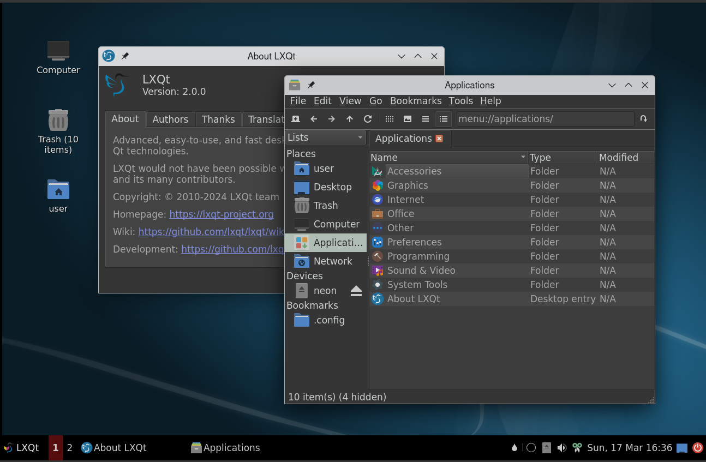

# lxqt-kwin-session

LXQt 2.1 and later provides a kwin-wayland session, beside other 6 compositors.
See also https://github.com/lxqt/lxqt/wiki/ConfigWaylandSettings .

## Screenshot

LXQt style "Dark"; Palette "Valendas"

## Features

* Switch user
* Screen lock
* Full wayland support in taskbar for workspaces
* Scaling per monitor
* Window effects
